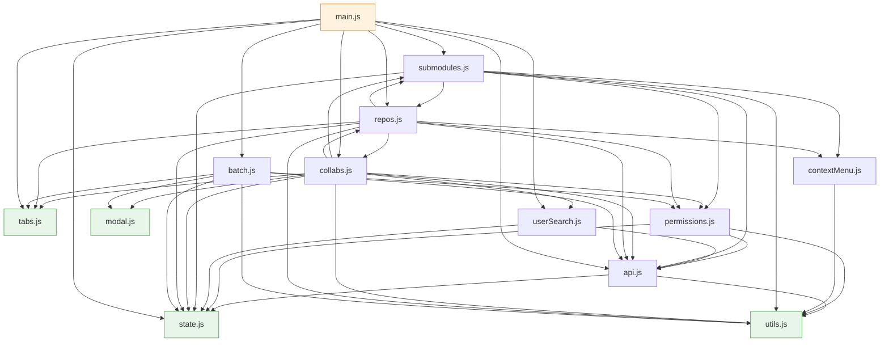

# 项目结构

Gitee 仓库权限管理器——浏览器端纯静态应用，GitHub Pages 部署。
零构建工具，沿用浏览器原生 ES Modules。

## 目录布局

```
gitee-repo-permission/
├── CNAME              # GitHub Pages 自定义域名
├── index.html         # 单页 UI + 内联样式
├── STRUCTURE.md       # 本文件
└── js/
    ├── state.js       # 共享可变状态 + PERM_LEVEL 常量
    ├── utils.js       # 日志 / 状态栏 / 剪贴板 / 文本解析
    ├── api.js         # Token UI + Gitee API 封装
    ├── permissions.js # 权限计算 / Badge 渲染 / 降级预检
    ├── modal.js       # 通用降级决策模态框
    ├── contextMenu.js # 通用右键上下文菜单（仓库 + 子模块）
    ├── userSearch.js  # 用户搜索 dropdown（自动补全）
    ├── tabs.js        # 桌面 / 移动端 tab 切换
    ├── submodules.js  # 子模块解析与渲染 + 复制链接
    ├── collabs.js     # 仓库详情 + 协作者 CRUD + 仓内批量
    ├── repos.js       # 仓库加载 / 列表渲染 / 剪贴板导入 + 复制链接
    ├── batch.js       # 跨仓库批量授权 / 移除
    └── main.js        # 入口：init + 事件绑定 + window 暴露
```

## 模块依赖图



`collabs.js ↔ repos.js`、`submodules.js → repos.js ↔ collabs.js → submodules.js` 等存在循环引用——
ESM 容忍，因为所有调用都发生在函数体内（运行时），不在模块顶层。
绿色节点为零依赖叶子模块，橙色节点为入口。

## 模块职责清单

| 模块 | 主要导出 | 说明 |
|---|---|---|
| **state.js** | `state`, `PERM_LEVEL` | 全部模块共享同一 `state` 对象引用 |
| **utils.js** | `setStatus`, `appendLog`, `clearLog`, `hoverShow/Clear`, `copyTextToClipboard`, `readTextFromClipboard`, `fallbackCopyText`, `extractRepoFullNamesFromText` | 纯工具，无外部依赖 |
| **api.js** | `giteeApi`, `giteeApiFetchAll`, `getToken`, `rememberToken`, `clearTokenCache`, `toggleTokenVisibility` | 所有 Gitee REST 调用统一入口 |
| **permissions.js** | `getRepoPermissionState`, `canSelectRepo`, `requestRepoPermission`, `createRepoPermissionBadgeWrap`, `getCurrentPermLevel`, `permLevelToLabel`, `fetchTargetUserPermLevel`, `precheckTargetUserPermissions`, `classifyDowngrades`, `repoMatchesFilter`, `getRepoApiPath`, `applyRepoPermissionData`, `findMainRepoByFullName`, `ensureRepoInMainList`, `shouldClearRepoSelection`, `getRepoSelectionDisabledTitle`, `shouldCopyRestrictedRepoUrl` | 权限读取、分类、降级预检 |
| **modal.js** | `showDowngradeDecisionModal` | 通用 Promise 化模态框（`batch` 三按钮 / `single` 两按钮），无外部依赖 |
| **contextMenu.js** | `showRepoContextMenu`, `showSubmoduleContextMenu`, `closeContextMenu` | 通用右键上下文菜单，支持边界检测和 ESC 关闭 |
| **userSearch.js** | `setupUserSearch`, `doUserSearch`, `renderUserDropdown`, `closeUserDropdown` | 用户搜索 dropdown，带 `state._userSearchCache` 缓存 |
| **tabs.js** | `switchTab`, `switchMobileTab` | tab 切换；纯 DOM |
| **submodules.js** | `getSubmoduleRepos`, `loadSubmodules`, `renderSubmoduleList`, `toggleSelectAllSubmodules`, `copyUnauthorizedSubmoduleUrls`, `copyNonAdminSubmoduleUrls`, `copySelectedSubmoduleUrls` | 解析 `.gitmodules` 并并发拉权限、右键菜单、复制链接 |
| **collabs.js** | `loadRepoDetail`, `renderCollabList`, `updateDetailPermBadges`, `updateCollabPermission`, `removeCollab`, `promptAddCollab`, `batchCollabUpdatePerm`, `batchCollabRemove`, `toggleSelectAllCollabs`, `updateCollabBatchBar` | 当前选中仓库的协作者管理 |
| **repos.js** | `loadAllRepos`, `renderRepoList`, `toggleSelectAllVisible`, `selectAllVisible`, `deselectAll`, `setBatchLoading`, `getPermGroup`, `openClipboardSelectModal`, `copySelectedRepoUrls` | 仓库列表加载与渲染、剪贴板导入、右键菜单、复制链接 |
| **batch.js** | `batchAddCollab`, `batchRemoveCollab` | 侧栏跨仓库批量授权/移除，含降级预检流程 |
| **main.js** | （无导出） | 启动 IIFE、四组事件监听、`Object.assign(window, ...)` 暴露 20 个函数 |

## 共享状态模型

`state.js` 导出单一可变对象，所有模块通过同一引用读写：

```js
export const state = {
  allRepos: [],              // 已加载的仓库列表
  selectedRepos: new Set(),  // 侧栏复选框选中
  currentRepo: null,         // 详情面板正在显示的仓库 full_name
  collapsedGroups: new Set(),// 折叠的权限分组
  currentCollabs: [],        // 当前仓库的协作者
  currentCollabsRepo: null,  // 上面这个属于哪个仓库
  selectedCollabs: new Set(),// 协作者批量勾选
  currentUser: '',           // 已登录用户的 login
  currentSubmodules: [],     // 当前仓库的子模块
  currentSubmodulesRepo: null,
  _loadGeneration: 0,        // 加载代次，用于忽略过期回调
  _userSearchCache: {},      // 用户搜索结果缓存
};

export const PERM_LEVEL = { pull: 0, push: 1, admin: 2 };
```

**约定**：
- 所有数组 / Set 用 `state.allRepos.push(...)` / `state.selectedRepos.add(...)` 形式
- 标量赋值用 `state.currentUser = '...'`
- 不要重新赋值整个 `state` 对象（会切断模块间引用同步）

## 关键数据流

### 1. 仓库加载

```
loadAllRepos (repos.js)
 ├─ giteeApi('GET','/user') → state.currentUser
 ├─ Phase A：并发拉 /user/repos 和 /orgs/*/repos
 │           每发现一个仓库 → addRepo → mergeRepo → permQueue.push
 ├─ Phase B：5 并发权限池（requestRepoPermission）
 │           permDone % RENDER_INTERVAL → sortAndRender
 └─ retryPendingPermissionRepos：兜底重拉权限失败的仓库
```

### 2. 批量授权（带降级保护）

```
batchAddCollab (batch.js)
 ├─ 过滤出 admin 权限的仓库
 ├─ confirm() 初次确认
 ├─ precheckTargetUserPermissions (permissions.js)
 │   并发 5，逐仓库拉 collaborators 列表，找目标用户的现有权限
 ├─ classifyDowngrades → { downgrades, failed, safe }
 ├─ 若有降级或失败 → showDowngradeDecisionModal('batch')
 │   ├─ 'keep'   → 执行全部
 │   ├─ 'skip'   → 仅执行 safe
 │   └─ 'cancel' → 中止
 └─ 顺序 PUT /repos/{}/collaborators/{}，输出到日志面板
```

### 3. 单仓库改权限（带降级保护）

```
updateCollabPermission (collabs.js)
 ├─ getCurrentPermLevel (permissions.js) 从 state.currentCollabs 取
 ├─ 若 currentLevel > newLevel → showDowngradeDecisionModal('single')
 │   两按钮：【保留降级 / 取消】
 ├─ 否则 confirm() 简单确认
 └─ PUT → loadRepoDetail 刷新
```

### 4. 剪贴板导入

```
openClipboardSelectModal (repos.js)
 ├─ 用户粘贴文本 → 解析 URL 列表（extractRepoFullNamesFromText）
 ├─ 跟 state.allRepos / state.currentSubmodules 匹配，分"已在列表"/"未在列表"
 ├─ 后台并发 requestRepoPermission 补权限
 └─ 用户勾选 → state.selectedRepos.add(...)
```

## HTML ↔ JS 桥接

`index.html` 内联了 20 个 `onclick="xxx()"` / `onchange="xxx()"` 引用。
ES Module 默认作用域隔离，需要 `main.js` 末尾显式挂到 `window`：

```js
Object.assign(window, {
  // api.js
  toggleTokenVisibility, rememberToken, clearTokenCache,
  // repos.js
  loadAllRepos, toggleSelectAllVisible, openClipboardSelectModal,
  copySelectedRepoUrls,
  // collabs.js
  promptAddCollab, toggleSelectAllCollabs,
  batchCollabUpdatePerm, batchCollabRemove,
  // batch.js
  batchAddCollab, batchRemoveCollab,
  // submodules.js
  toggleSelectAllSubmodules, copyUnauthorizedSubmoduleUrls,
  copyNonAdminSubmoduleUrls, copySelectedSubmoduleUrls,
  // tabs.js
  switchTab, switchMobileTab,
});
```

新增内联 onclick 时必须同步在此暴露。

## 本地运行

> ⚠️ **不能直接双击 `index.html` 用 `file://` 打开**。
> 浏览器对 ES Module 的同源策略要求 `http(s)://` 协议，`file://` 下会报
> `Failed to fetch dynamically imported module`。

任选一种本地 HTTP 服务方式：

### 方式 1：Python（无需安装额外依赖）

```bash
cd /Users/user01/Documents/gitee-repo-permission
python3 -m http.server 8080
# 浏览器打开 http://localhost:8080/
```

按 `Ctrl+C` 停止。

### 方式 2：Node.js (npx)

```bash
cd /Users/user01/Documents/gitee-repo-permission
npx --yes http-server -p 8080 -c-1
# -c-1 关闭缓存，开发时改文件后刷新立即生效
```

### 方式 3：VS Code Live Server 扩展

1. 安装扩展：`Live Server` (作者 Ritwick Dey)
2. 右下角点 **Go Live**，自动开浏览器并热刷新

### 方式 4：直接用 IDE 内置预览

VS Code / JetBrains 系都内置 HTTP 预览，右键 `index.html` → Open with Live Preview。

## 调试

- 全部错误看浏览器 **DevTools → Console**。ESM 加载失败、API 报错都在这里。
- 网络请求看 **Network**，过滤 `gitee.com/api` 看 REST 调用与响应。
- 操作日志面板（页面右下"操作日志"tab）已记录每次授权/移除的结果。
- 修改 JS 后浏览器需 **硬刷新**（Cmd+Shift+R / Ctrl+Shift+R）绕过缓存。

## 验证整体可用性

代码改动后建议跑一遍核心路径：

1. 输入 Token → **加载仓库**，列表出来无 console 报错
2. 选中多个仓库 → 看右侧详情切换
3. 在某仓库内**修改单个协作者权限**（含降级），覆盖降级模态框
4. **批量授权**：选中多个库 + 输入用户名 + 选权限 + 点 `+ 添加`，
   覆盖预检 + 三按钮决策（保留降级 / 忽略降级 / 取消）
5. **从剪贴板导入**：粘贴含 Gitee URL 的文本，匹配并选中
6. **切换 tab**（仓库详情 / 操作日志），移动端窄屏 tab 切换
7. **记住 Token** / **清除 Token 缓存**

## 部署

GitHub Pages 直接服务静态文件，无需构建。
`CNAME` 文件指定自定义域名。
推送到 `main` 分支后由 Pages 自动发布。

## 修改指引

| 想做什么 | 改哪里 |
|---|---|
| 加 / 改 Gitee API 调用 | `api.js` |
| 新增权限相关计算 | `permissions.js` |
| 加新模态框 | 在对应业务模块或独立 `modal*.js` |
| 加新上下文菜单项 | `contextMenu.js` 的 `showContextMenu` 函数 |
| 加新仓库列表过滤 | `permissions.js` 的 `repoMatchesFilter` + `repos.js` 的 `renderRepoList` |
| 加新 HTML 元素带 onclick | 写实现 + 在 `main.js` 的 `Object.assign(window, ...)` 暴露 |
| 加新共享状态 | `state.js` 加字段；其他模块用 `state.X` |
| 修复 `\u` 转义 / 字面中文不一致 | 历史遗留，按模块逐步统一即可（非紧急） |
