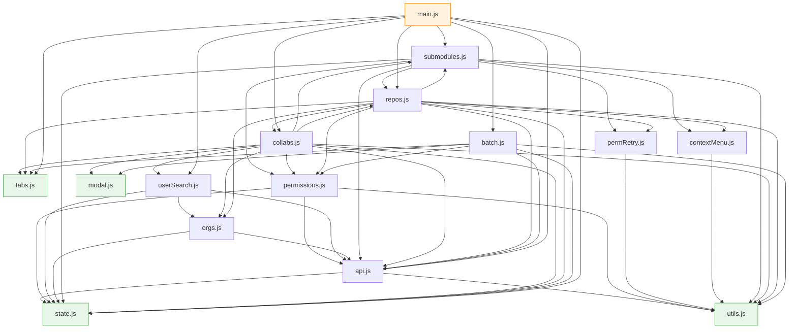

# 项目结构

Gitee 仓库权限管理器——浏览器端纯静态应用，GitHub Pages 部署。
零构建工具，沿用浏览器原生 ES Modules。

## 目录布局

```
gitee-repo-permission/
├── CNAME              # GitHub Pages 自定义域名
├── index.html         # 单页 UI + 内联样式
├── STRUCTURE.md       # 本文件
└── js/
    ├── state.js       # 共享可变状态 + PERM_LEVEL 常量
    ├── utils.js       # 日志 / 状态栏 / 剪贴板 / 文本解析
    ├── api.js         # Token UI + Gitee API 封装
    ├── permissions.js # 权限计算 / Badge 渲染 / 降级预检
    ├── permRetry.js   # 权限加载失败后的后台循环重试
    ├── modal.js       # 通用降级决策模态框
    ├── contextMenu.js # 通用右键上下文菜单（仓库 + 子模块）
    ├── userSearch.js  # 用户搜索 dropdown（自动补全）
    ├── orgs.js        # 组织数据（我的组织 / 反向成员索引）+ 徽章渲染
    ├── tabs.js        # 桌面 / 移动端 tab 切换
    ├── submodules.js  # 子模块解析与渲染 + 分支选择 + 复制链接
    ├── collabs.js     # 仓库详情 + 协作者 CRUD + 仓内批量
    ├── repos.js       # 仓库加载 / 列表渲染 / 剪贴板导入 + 复制链接
    ├── batch.js       # 跨仓库批量授权 / 移除
    └── main.js        # 入口：init + 事件绑定 + window 暴露
```

## 模块依赖图



`collabs.js ↔ repos.js`、`submodules.js → repos.js ↔ collabs.js → submodules.js` 等存在循环引用——
ESM 容忍，因为所有调用都发生在函数体内（运行时），不在模块顶层。
绿色节点为零依赖叶子模块，橙色节点为入口。

## 模块职责清单

| 模块 | 主要导出 | 说明 |
|---|---|---|
| **state.js** | `state`, `PERM_LEVEL` | 全部模块共享同一 `state` 对象引用 |
| **utils.js** | `setStatus`, `appendLog`, `clearLog`, `hoverShow/Clear`, `copyTextToClipboard`, `readTextFromClipboard`, `fallbackCopyText`, `extractRepoFullNamesFromText`, `repoUrl` | 纯工具，无外部依赖；`repoUrl` 统一"取 html_url，缺失则回退 https://gitee.com/full_name" |
| **api.js** | `giteeApi`, `giteeApiRetry`, `giteeApiFetchAll`, `getToken`, `rememberToken`, `clearTokenCache`, `toggleTokenVisibility`, `isRetryableApiError` | 所有 Gitee REST 调用统一入口；`isRetryableApiError` 判定失败是否为网络类（可重试）；`giteeApiRetry` 带指数退避重试 + 可诊断报错（见下节） |
| **permissions.js** | `getRepoPermissionState`, `canSelectRepo`, `requestRepoPermission`, `createRepoPermissionBadgeWrap`, `getCurrentPermLevel`, `permLevelToLabel`, `fetchTargetUserPermLevel`, `precheckTargetUserPermissions`, `classifyDowngrades`, `repoMatchesFilter`, `getRepoApiPath`, `applyRepoPermissionData`, `findMainRepoByFullName`, `ensureRepoInMainList`, `shouldClearRepoSelection`, `getRepoSelectionDisabledTitle` | 权限读取、分类、降级预检 |
| **permRetry.js** | `registerPermRetry`, `unregisterPermRetry`, `clearPermRetries` | 权限加载失败后的后台定时重试：Map 存任务，每 4s 一轮，成功或失效即移除，队列空自动停表 |
| **modal.js** | `showDowngradeDecisionModal` | 通用 Promise 化模态框（`batch` 三按钮 / `single` 两按钮），无外部依赖 |
| **contextMenu.js** | `showRepoContextMenu`, `showSubmoduleContextMenu`, `closeContextMenu` | 通用右键上下文菜单，支持边界检测和 ESC 关闭 |
| **userSearch.js** | `setupUserSearch`, `doUserSearch`, `renderUserDropdown`, `closeUserDropdown` | 用户搜索 dropdown，带 `state._userSearchCache` 缓存；条目内组织展示委托给 `orgs.js`。**本文件保持 ASCII-only（中文用 `\u` 转义）**，写入时勿改成字面中文 |
| **orgs.js** | `loadMyOrgs`, `loadMyOrgMemberIndex`, `fetchUserPublicOrgs`, `resolveUserOrgs`, `renderOrgBadges`, `renderMyOrgsBadge`, `attachOrgRow`, `hideOrgPopover`, `resetOrgCaches` | 组织数据与徽章渲染（被 `userSearch.js` / `collabs.js` / `repos.js` 共用）。**保持 ASCII-only（中文用 `\u` 转义）**——注释里也别用 `─` 等非 ASCII 符号，会把整个文件写成 iso-8859-1 |
| **tabs.js** | `switchTab`, `switchMobileTab` | tab 切换；纯 DOM |
| **submodules.js** | `getSubmoduleRepos`, `loadSubmodules`, `loadSubmodulesForRef`, `loadRepoBranches`, `renderSubmoduleList`, `toggleSelectAllSubmodules`, `copyUnauthorizedSubmoduleUrls`, `copyNonAdminSubmoduleUrls`, `copySelectedSubmoduleUrls`, `copyPullOnlySubmoduleUrls`, `copyFailedSubmoduleUrls`, `toggleBranchMenu`, `closeBranchMenu`, `filterBranchList` | 按分支解析 `.gitmodules` 并并发拉权限、右键菜单、按权限状态复制链接（无权限 / 权限请求失败 / 只读 / 无管理权限 / 选中）；分支选择器（带搜索）切换后按 `ref` 重载 |
| **collabs.js** | `loadRepoDetail`, `renderCollabList`, `updateDetailPermBadges`, `updateCollabPermission`, `removeCollab`, `promptAddCollab`, `batchCollabUpdatePerm`, `batchCollabRemove`, `toggleSelectAllCollabs`, `updateCollabBatchBar` | 当前选中仓库的协作者管理；每个协作者下方经 `orgs.js` 的 `attachOrgRow` 显示所属（共同）组织 |
| **repos.js** | `loadAllRepos`, `renderRepoList`, `toggleSelectAllVisible`, `selectAllVisible`, `deselectAll`, `setBatchLoading`, `getPermGroup`, `openClipboardSelectModal`, `copySelectedRepoUrls` | 仓库列表加载与渲染、剪贴板导入、右键菜单、复制链接 |
| **batch.js** | `batchAddCollab`, `batchRemoveCollab` | 侧栏跨仓库批量授权/移除，含降级预检流程 |
| **main.js** | （无导出） | 启动 IIFE、四组事件监听、`Object.assign(window, ...)` 暴露 26 个函数 |

## 共享状态模型

`state.js` 导出单一可变对象，所有模块通过同一引用读写：

```js
export const state = {
  allRepos: [],              // 已加载的仓库列表
  selectedRepos: new Set(),  // 侧栏复选框选中
  currentRepo: null,         // 详情面板正在显示的仓库 full_name
  collapsedGroups: new Set(),// 折叠的权限分组
  currentCollabs: [],        // 当前仓库的协作者
  currentCollabsRepo: null,  // 上面这个属于哪个仓库
  selectedCollabs: new Set(),// 协作者批量勾选
  currentUser: '',           // 已登录用户的 login
  currentSubmodules: [],     // 当前仓库的子模块
  currentSubmodulesRepo: null,
  currentSubmodulesBranch: null, // 子模块当前查看的分支
  currentBranches: [],       // 当前仓库分支列表（分支选择器用）
  _loadGeneration: 0,        // 加载代次，用于忽略过期回调
  _userSearchCache: {},      // 用户搜索结果缓存
  _userOrgsCache: {},        // login → 公开组织[]（失败不缓存）
  _pendingUserOrgs: {},      // 公开组织请求的并发去重
  _myOrgs: null,             // 我所在的组织[]
  _myOrgMemberIndex: null,   // login → 我的组织[]（反向成员索引）
};

export const PERM_LEVEL = { pull: 0, push: 1, admin: 2 };
```

**约定**：
- 所有数组 / Set 用 `state.allRepos.push(...)` / `state.selectedRepos.add(...)` 形式
- 标量赋值用 `state.currentUser = '...'`
- 不要重新赋值整个 `state` 对象（会切断模块间引用同步）

## 关键数据流

### 1. 仓库加载

```
loadAllRepos (repos.js)
 ├─ giteeApi('GET','/user') → state.currentUser
 ├─ Phase A：并发拉 /user/repos 和 /orgs/*/repos
 │           每发现一个仓库 → addRepo → mergeRepo → permQueue.push
 ├─ Phase B：5 并发权限池（requestRepoPermission）
 │           permDone % RENDER_INTERVAL → sortAndRender
 ├─ retryPendingPermissionRepos：兜底重拉仍未完成(!permissionLoaded)的仓库
 └─ 权限失败(permissionError) → registerPermRetry(permRetry.js)：后台每 4s 循环补拉直至成功
```

### 2. 批量授权（带降级保护）

```
batchAddCollab (batch.js)
 ├─ 过滤出 admin 权限的仓库
 ├─ confirm() 初次确认
 ├─ precheckTargetUserPermissions (permissions.js)
 │   并发 5，逐仓库拉 collaborators 列表，找目标用户的现有权限
 ├─ classifyDowngrades → { downgrades, failed, safe }
 ├─ 若有降级或失败 → showDowngradeDecisionModal('batch')
 │   ├─ 'keep'   → 执行全部
 │   ├─ 'skip'   → 仅执行 safe
 │   └─ 'cancel' → 中止
 └─ 顺序 PUT /repos/{}/collaborators/{}，输出到日志面板
```

### 3. 单仓库改权限（带降级保护）

```
updateCollabPermission (collabs.js)
 ├─ getCurrentPermLevel (permissions.js) 从 state.currentCollabs 取
 ├─ 若 currentLevel > newLevel → showDowngradeDecisionModal('single')
 │   两按钮：【保留降级 / 取消】
 ├─ 否则 confirm() 简单确认
 └─ PUT → loadRepoDetail 刷新
```

### 4. 剪贴板导入

```
openClipboardSelectModal (repos.js)
 ├─ 用户粘贴文本 → 解析 URL 列表（extractRepoFullNamesFromText）
 ├─ 跟 state.allRepos / state.currentSubmodules 匹配，分"已在列表"/"未在列表"
 ├─ 后台并发 requestRepoPermission 补权限
 └─ 用户勾选 → state.selectedRepos.add(...)
```

## 权限加载失败的后台重试
`permRetry.js` 提供全局定时重试服务，解决弱网下权限拉取失败、以及主库权限未就绪时打开子模块导致的子模块权限失败。
- `registerPermRetry(id, task)`：登记待重试任务；`task` 含 `isValid()`、`run()`（返回 `ok` 成功即移除 / `retry` 保留下轮再试 / `stop` 放弃并移除；兼容旧的 true/false）、`label`。
- `setInterval` 每 4s 轮询：`isValid()` 假则丢弃，`run()` 真则移除，其余下轮再试；队列清空自动 `clearInterval`，无定时器泄漏。
- `ticking` 防止上一轮未完成时重入；`await run()` 后二次校验，处理等待期间被清空/失效的竞态。
接入点：
- 仓库列表：`repos.js` 的 `permWorker` 中 `requestRepoPermission` 返回网络类失败（`retryable`）才以 `repo:<full_name>` 登记；`isValid` 绑定 `_loadGeneration`，重新加载（`clearPermRetries`）即失效。
- 子模块：`submodules.js` 的 `loadSubmodules` 与主流程同规则——403/404 判为「无权限」（`permissionError=false`，不重试）；仅当 `isRetryableApiError` 判为网络类时才用 `registerSubmoduleRetry` 以 `sub:<repo>:<sub>` 登记；`isValid` 绑定 `currentRepo`/`currentSubmodulesRepo`/成员关系，切库即失效。
- 重试范围：只重试网络类失败——fetch/网络失败（`giteeApi` 捕获并标记 `isNetworkError`）、408、429、5xx；永久性错误（401、200 但无 permission、缺 Token 等非网络错误）判为 `stop` 不再重试。分类见 `api.js` 的 `isRetryableApiError`。
- 权限状态归类（`requestRepoPermission` 与 `loadSubmodules` 一致）：**403/404 视为"无访问权限"** → 置 `permission={}, permissionError=false`，落入「无权限(unauthorized)」组，不重试（Gitee 对无权/隐藏/不存在的库统一返回 404 `Not Found Project`，实证确认；未加入相应团队的子模块即走此路）。其余抛错（401/网络/5xx 等）→ `permissionError=true` 落「权限请求失败(failed)」组，网络类可后台重试。
- 复制链接：
  - `repos.js` 的 `renderRepoList` 在「权限请求失败」与「无权限」两组的分组标题右侧各注入一个「复制链接」按钮，复制本组（受当前搜索过滤）全部仓库链接。
  - 子模块面板 ⋮ 菜单按权限状态复制：无权限（`copyUnauthorizedSubmoduleUrls`）/ 权限请求失败（`copyFailedSubmoduleUrls`）/ 只读（`copyPullOnlySubmoduleUrls`）/ 无管理权限（`copyNonAdminSubmoduleUrls`），以及复制选中（`copySelectedSubmoduleUrls`）。
- 错误可诊断性与重试（`api.js`）：
  - **每条报错都带接口标识**：`giteeApi` 把 `方法 + 路径`（去掉查询串）写进 `message`，并在错误对象上挂 `method` / `path` / `label` / `status`，避免出现「API 404: Not Found Project」却不知是哪个接口。
  - **网络类失败给出成因而非 `Failed to fetch`**：`fetch` 被 reject 时浏览器不提供状态码（控制台只显示 CORS 或 `net::ERR_FAILED`），故消息里直接写明可能原因（浏览器扩展/网络拦截、跨域预检被拦、网络中断）并给出可执行建议（开无痕窗口禁用扩展重试），同时保留原始 message 便于深入排查；`navigator.onLine === false` 时改为明确的「浏览器处于离线状态」，并置 `err.offline`。
  - **`giteeApiRetry`**：网络类 + 408/429/5xx 指数退避重试（默认 3 次，0.5s/1s/2s + 抖动）；服务端给了 `Retry-After` 就优先照它等（错误对象上挂 `retryAfter`），但**封顶 10s**（`MAX_RETRY_AFTER_MS`）——否则服务端给个 3600 界面就等于卡死；`Retry-After` 为 HTTP-date 形式时不采纳，退回指数退避。**每次重试都写日志**（第几次、失败原因、等待多久、是否服务端要求），成功与最终失败也留痕——否则"重试了几次、为什么"完全不可见。`{ silent: true }` 供后台静默重试使用。
  - **只对幂等方法（GET/HEAD）自动重试**：网络类失败无法区分"请求没发出去"与"已生效但响应丢了"，对 POST/PUT/DELETE 重试可能重复执行（如重复添加协作者）。非幂等方法直接透传单次调用，确需重试要显式传 `{ allowUnsafeRetry: true }`。
  - 写日志经 `logQuietly` 包一层 try/catch：日志面板不存在时，记日志失败**不得掩盖真正的业务错误**。
  - 接入点：首个 `/user`、`/user/repos` 与 `/orgs/{org}/repos` 分页、`giteeApiFetchAll` 各页、`.gitmodules` 读取。**首个 `/user` 原先无任何重试，一次抖动就整个加载中止**（这是"经常报 CORS 错误"的痛感来源）。
  - 每仓库权限（`permissions.js`）不走这里：它有独立的 `permRetry` 后台重试，叠加会让延迟翻倍。
  - **失败不得伪装成空**：`getSubmoduleRepos` 只对 **404**（该分支确实没有 `.gitmodules`）静默返回 `[]`；其它失败记日志并抛出，UI 显示「加载子模块失败: 原因」。此前一律 `catch` 成 `[]`，界面显示「暂无子模块」，会让人误判仓库真的没有子模块。错误渲染前同样要过 `currentRepo` / `currentSubmodulesBranch` 的过期检查，避免把过期错误显示到已切换的仓库上。
  - 关于 CORS 报错的实测结论：Gitee 的预检与响应**本身带全套 CORS 头**（`OPTIONS` 返回 `Access-Control-Allow-Origin: *`、`Allow-Headers: authorization`，200/404 响应亦带；45 并发与真实 Chrome 12 连发均全部成功）。故这类报错并非 Gitee 配置缺失，而是偶发被拦截/限流后返回了不带 CORS 头的响应。**认证仍用 `Authorization` 头**，不改用 `access_token` 查询参数——后者虽可免预检，但会把 Token 暴露在 URL / 历史 / Referer 里。
- 组织展示（`orgs.js`）：
  - **Gitee 隐私限制（实测）**：`GET /users/{login}/orgs` 只返回**公开的**成员关系，绝大多数用户返回 `[]`（已验证：`red_base` 的 113 名成员中，`leonli`/`dancingfish`/`inphyy` 等经该接口均为空）。这不是权限问题，需对方自行公开，无法绕过。
  - **主数据源改为"我的组织反查"**：`loadMyOrgMemberIndex` 用 `GET /user/orgs` + 各组织 `GET /orgs/{org}/members`（`giteeApiFetchAll` 分页）建 `login → 组织[]` 反向索引，缓存于 `state._myOrgMemberIndex`。因自己是组织成员，有权列成员，故**无视对方是否公开**。实测成本：2 个组织 / 113+6 人 ≈ 1.4s、3 个请求，仅加载一次。
  - `resolveUserOrgs(login)` 合并两个来源：共同组织（`shared:true`，主色高亮 `.ud-org-shared`）+ 对方公开的其他组织（灰底，`title` 标注"仅公开信息"）。
  - `renderOrgBadges` 统一渲染三形态：空 → 「无共同组织」（**不写"无组织"**，因私有成员关系不可见）、单个 → 1 徽章、多个 → 前 `max`(默认 2) 个 + 「+N」。折叠态 DOM 节点数恒定（≤ max+1），30 个组织也不会撑爆布局。
  - **「+N」悬浮浮层**：鼠标移到 `+N` 立即弹出 `.org-popover` 列出**全部**组织。浮层挂在 `document.body` 上并用 `position:fixed` + 视口避让，因此不受父级 `overflow:hidden` 裁剪、不引起布局跳动（早期"就地展开"方案在顶栏会被 flex 压成碎条，故废弃）；`pointer-events:none`，移开即销毁，重复悬浮幂等。
  - **title 策略**：`title` 只加在**单个徽章**上（解释被 CSS `ellipsis` 截断的长名）。容器与 `+N` **一律不加 `title`**——否则原生提示（约 1s 延迟）会盖住即时浮层。测试有断言守这条。
  - 三个接入点：
    - 用户搜索下拉：两个入口（侧栏批量授权输入框、`promptAddCollab` 模态框）共用 `renderUserDropdown`，只在此处接入即可全覆盖；用 `orgFillGeneration` 丢弃过期填充。合并两个来源。
    - 仓库协作者列表（`collabs.js` 的 `renderCollabList`）：用 `attachOrgRow(login, { publicOrgs: false, isStale })`。**协作者可能上百人，故只用共同组织索引，`publicOrgs:false` 保证每人零额外请求**，避免触发限流；`isStale` 绑定 `state.currentRepo`，切库即丢弃过期结果。代价是这里看不到"对方公开的其他组织"。
    - 右上角 profile：`repos.js` 的 `loadAllRepos` 取到 `/user` 后调 `renderMyOrgsBadge()` 渲染到 `#current-user-orgs`；自己的组织可完整看到，故空时显示「无组织」。
  - **账号级缓存必须随 Token 失效**：`loadAllRepos` 在重新识别账号前调用 `resetOrgCaches()`，否则换 Token 后会沿用上一个账号的组织做"共同组织"判定。
  - 已知限制：索引成本随组织规模线性增长（组织数 × 成员分页）。当前规模（2 组织 / 119 人 ≈ 1.4s）无感；若某账号属于很多大组织，首次搜索会明显变慢（未做懒加载，属预防性优化，暂缓）。
- 子模块分支选择器：打开仓库时 `loadSubmodules` 先经 `loadRepoBranches`（`GET /repos/{full}/branches` + `/repos/{full}` 的 `default_branch`）取分支列表与默认分支，标题旁按钮展开"带搜索框的下拉窗口"（`toggleBranchMenu`/`filterBranchList`）；选择分支后 `loadSubmodulesForRef(full, ref)` 以 `?ref=<branch>` 重新读取 `.gitmodules` 并刷新。状态存 `state.currentSubmodulesBranch` / `state.currentBranches`；带 `ref !== currentSubmodulesBranch` 的过期响应会被丢弃。

## HTML ↔ JS 桥接

`index.html` 内联了 26 个 `onclick="xxx()"` / `onchange="xxx()"` 引用。
ES Module 默认作用域隔离，需要 `main.js` 末尾显式挂到 `window`：

```js
Object.assign(window, {
  // api.js
  toggleTokenVisibility, rememberToken, clearTokenCache,
  // repos.js
  loadAllRepos, toggleSelectAllVisible, openClipboardSelectModal,
  copySelectedRepoUrls,
  // collabs.js
  promptAddCollab, toggleSelectAllCollabs,
  batchCollabUpdatePerm, batchCollabRemove,
  // batch.js
  batchAddCollab, batchRemoveCollab,
  // submodules.js
  toggleSelectAllSubmodules, copyUnauthorizedSubmoduleUrls,
  copyNonAdminSubmoduleUrls, copySelectedSubmoduleUrls,
  // tabs.js
  switchTab, switchMobileTab,
});
```

新增内联 onclick 时必须同步在此暴露。

## 本地运行

> ⚠️ **不能直接双击 `index.html` 用 `file://` 打开**。
> 浏览器对 ES Module 的同源策略要求 `http(s)://` 协议，`file://` 下会报
> `Failed to fetch dynamically imported module`。

任选一种本地 HTTP 服务方式：

### 方式 1：Python（无需安装额外依赖）

```bash
cd /Users/user01/Documents/gitee-repo-permission
python3 -m http.server 8080
# 浏览器打开 http://localhost:8080/
```

按 `Ctrl+C` 停止。

### 方式 2：Node.js (npx)

```bash
cd /Users/user01/Documents/gitee-repo-permission
npx --yes http-server -p 8080 -c-1
# -c-1 关闭缓存，开发时改文件后刷新立即生效
```

### 方式 3：VS Code Live Server 扩展

1. 安装扩展：`Live Server` (作者 Ritwick Dey)
2. 右下角点 **Go Live**，自动开浏览器并热刷新

### 方式 4：直接用 IDE 内置预览

VS Code / JetBrains 系都内置 HTTP 预览，右键 `index.html` → Open with Live Preview。

## 调试

- 全部错误看浏览器 **DevTools → Console**。ESM 加载失败、API 报错都在这里。
- 网络请求看 **Network**，过滤 `gitee.com/api` 看 REST 调用与响应。
- 操作日志面板（页面右下"操作日志"tab）已记录每次授权/移除的结果。
- 修改 JS 后浏览器需 **硬刷新**（Cmd+Shift+R / Ctrl+Shift+R）绕过缓存。

## 验证整体可用性

代码改动后建议跑一遍核心路径：

1. 输入 Token → **加载仓库**，列表出来无 console 报错
2. 选中多个仓库 → 看右侧详情切换
3. 在某仓库内**修改单个协作者权限**（含降级），覆盖降级模态框
4. **批量授权**：选中多个库 + 输入用户名 + 选权限 + 点 `+ 添加`，
   覆盖预检 + 三按钮决策（保留降级 / 忽略降级 / 取消）
5. **从剪贴板导入**：粘贴含 Gitee URL 的文本，匹配并选中
6. **切换 tab**（仓库详情 / 操作日志），移动端窄屏 tab 切换
7. **记住 Token** / **清除 Token 缓存**

## 部署

GitHub Pages 直接服务静态文件，无需构建。
`CNAME` 文件指定自定义域名。
推送到 `main` 分支后由 Pages 自动发布。

## 修改指引

| 想做什么 | 改哪里 |
|---|---|
| 加 / 改 Gitee API 调用 | `api.js` |
| 新增权限相关计算 | `permissions.js` |
| 加新模态框 | 在对应业务模块或独立 `modal*.js` |
| 加新上下文菜单项 | `contextMenu.js` 的 `showContextMenu` 函数 |
| 加新仓库列表过滤 | `permissions.js` 的 `repoMatchesFilter` + `repos.js` 的 `renderRepoList` |
| 加新 HTML 元素带 onclick | 写实现 + 在 `main.js` 的 `Object.assign(window, ...)` 暴露 |
| 加新共享状态 | `state.js` 加字段；其他模块用 `state.X` |
| 修复 `\u` 转义 / 字面中文不一致 | 历史遗留，按模块逐步统一即可（非紧急） |
